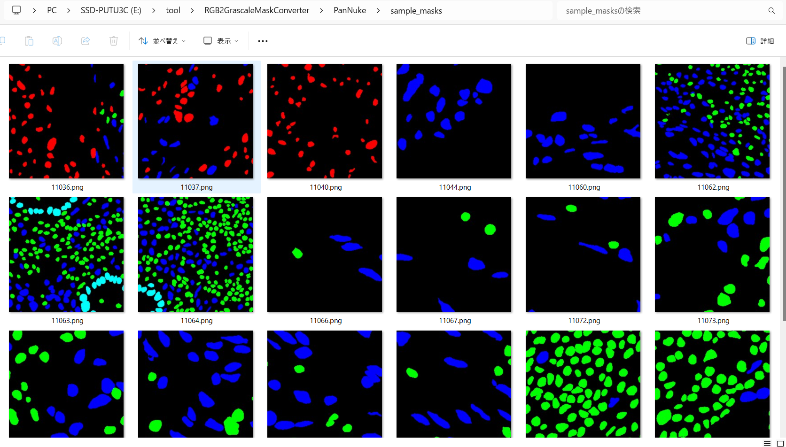
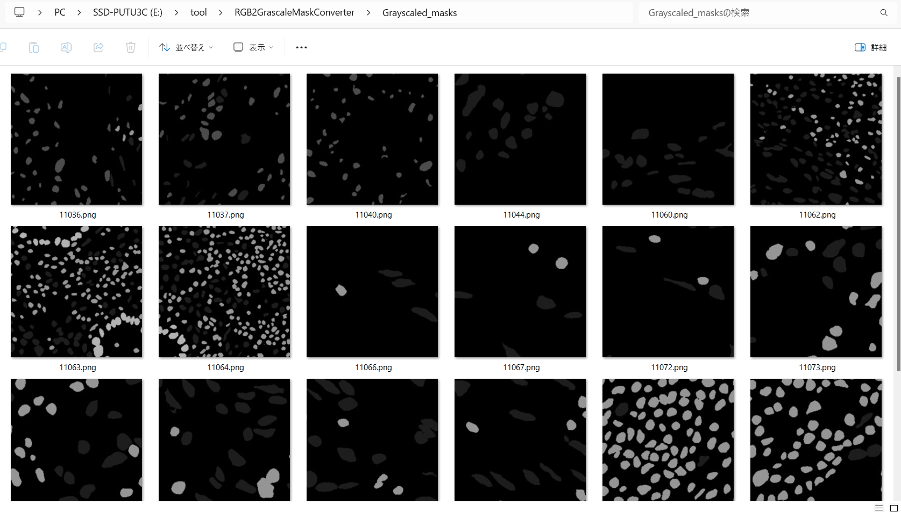

<h2>RGBMask-To-GrayscaleMask-Conversion-Tool</h2>

This is a Python Conversion Tool to convert RGBMask to GrayScaleMask for Image Segmentation. 

<h3>1. RGB2GrayscaleMaskConverter</h3>
This <a href="./RGB2GrayscaleMaskConverter.py">RGB2GrayscaleMaskConverter,py</a> is a simple Python script
to convert a RGB-MaskDataset to a Grayscale-MaskDataset.  
It is easily customizable by a <a href="./grayscale_converter.config">grayscale_converter.config.</a> 
In the <a href="./RGB2GrayscaleMaskConverter.py">RGB2GrayscaleMaskConverter,py</a>, we convert a RGBMask-Dataset
to a GrayscaleMask-Datatset in the following way. 

<pre>
1, Read a mutli-class-rgb-mask file in a maskdataset folder.
2. Split the mutli-class-rgb-mask to some multi-class-grayscale-masks depending on the number of classes for segemetation.
3. Merge the multiple grayscale-masks to a single grayscale mask. 
4. Save the merged grayscale-masks to a file to an ouput_folder.
</pre>
We use the following grayscaling parameter to conver a set of (R,G, B) pixel in a rgb-mask to a grayscale intensity. 
<pre>
gray = 0.299 * R + 0.587 * G + 0.114 * B
</pre>   
On detail of the parameter, please refer to 
<a href="https://stackoverflow.com/questions/687261/converting-rgb-to-grayscale-intensity">
Converting RGB to grayscale/intensity
</a>

Except from the web-site above. 
<pre>
On the grascaling parameters to convert a set of (r,g,b) color pixles to a grayscale intensity,
please, see also: https://en.wikipedia.org/wiki/Luma_(video)

For digital formats following CCIR 601 (i.e. most digital standard definition formats), 
luma is calculated with this formula:

gray = 0.299 * R + 0.587 * G + 0.114 * B

Formats following ITU-R Recommendation BT. 709 (i.e. most digital high definition formats)  
use a different formula:

gray = 0.2126 * R + 0.7152 * G + 0.0722 * B
</pre>

<h3>2. PanNuke ImageMaskDataset</h3>
For a simple example, we will try convert RGBMaskDataset for 
<a href="https://github.com/sarah-antillia/ImageMask-Dataset-PanNuke">ImageMask-Dataset-PanNuke</a>. 
<pre>
The dataset used here has been taken from.
https://www.kaggle.com/datasets/andrewmvd/cancer-inst-segmentation-and-classification
About this Dataset

This dataset, also known as PanNuke, contains semi automatically generated nuclei instance segmentation and 
classification images with exhaustive nuclei labels across 19 different tissue types. The dataset consists 
of 481 visual fields, of which 312 are randomly sampled from more than 20K whole slide images at different 
magnifications, from multiple data sources.
In total the dataset contains 205,343 labeled nuclei, each with an instance segmentation mask. Models trained 
on PanNuke can aid in whole slide image tissue type segmentation, and generalize to new tissues.

More Medical Imaging Datasets
Part 1 (current)
Part 2
Part 3
More datasets
Acknowledgements
If you use this dataset in your research, please credit the authors:

Original Publications
@article{gamper2020pannuke,
title={PanNuke Dataset Extension, Insights and Baselines},
author={Gamper, Jevgenij and Koohbanani, Navid Alemi and Graham, Simon and Jahanifar, Mostafa and Benet, 
Ksenija and Khurram, Syed Ali and Azam, Ayesha and Hewitt, Katherine and Rajpoot, Nasir},
journal={arXiv preprint arXiv:2003.10778},
year={2020}
}

@inproceedings{gamper2019pannuke,
title={Pannuke: An open pan-cancer histology dataset for nuclei instance segmentation and classification},
author={Gamper, Jevgenij and Koohbanani, Navid Alemi and Benet, Ksenija and Khuram, Ali and Rajpoot, Nasir},
booktitle={European Congress on Digital Pathology},
pages={11--19},
year={2019},
organization={Springer}
}

Hovernet formated files were provided by chandlertimm with the available code here.

License
CC BY NC SA 4.0

Splash Image
Image by Otis Brawley released as public domain by National Cancer Institute, available here

</pre>

<h3>3. Convert RGBMaskDataset to GrayscaleMaskDataset </h3>
Please run the following command to convert a RGB-MaskDataset to a Grayscale-MaskDataset. 
<pre>
>python RGB2GrayscaleMaskConverter.py ./grayscale_converter.config
</pre>
, where grayscale_converter.config is the following. 
<pre>
;grayscale_converter.config
; Copyright (C) antillia.com
; 2024/04/16
; This is an exaample of mini-test dataset of PanNuk dataset
;On the mask_colors in this config file, please see https://github.com/sarah-antillia/ImageMask-Dataset-PanNuke

[grayscale_converter]
image_width  = 512
image_height = 512
color_order  = "bgr"
masks_dir   = "./PanNuke/sample_masks/"
output_dir   = "./Grayscaled_masks/"

; R, G, B intensity for converting rgb to grayscale: CCIR 601
grayscaling  = (0.299, 0.587, 0.114)

; BT. 709
;grayscaling  = (0.2126, 0.7152, 0.0722)

mask_colors = [(0, 0, 0), (  0, 255,   0),  (255,   0,   0),  (  0,   0, 255),  (255, 255,   0), (  0, 255, 255),]
classes     = ["Background", "Neoplastic cells", "Inflammatory", "Connective/Soft tissue cells","Dead Cells", "Epithelial"]   
</pre>

<b>PanNuke RGB Masks</b> 
 

<b>Converted Grayscale Masks</b> 
 
 
